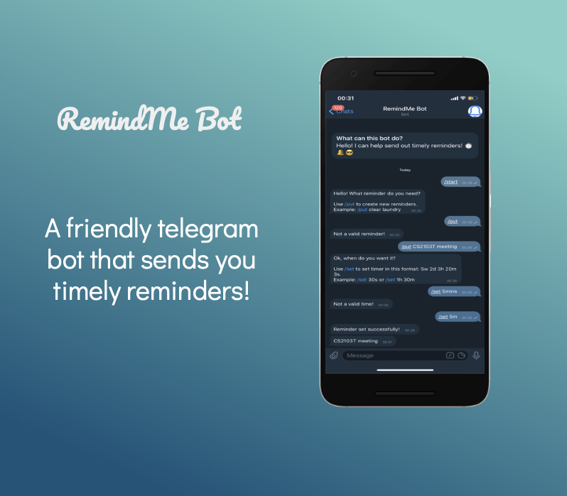
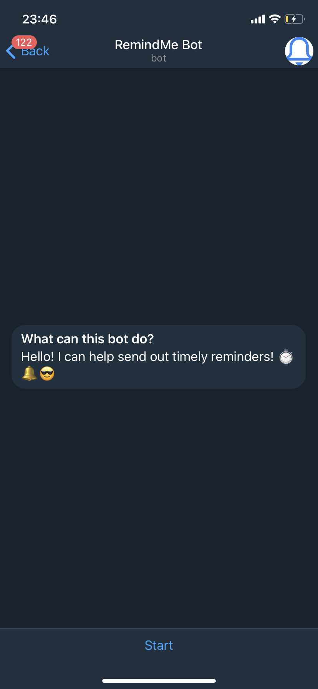
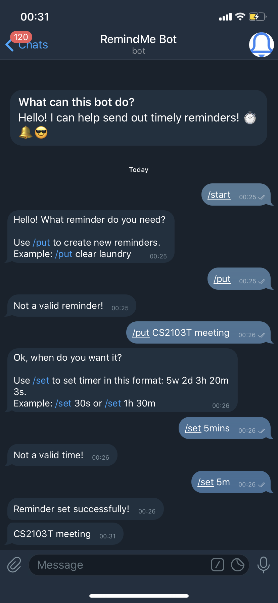
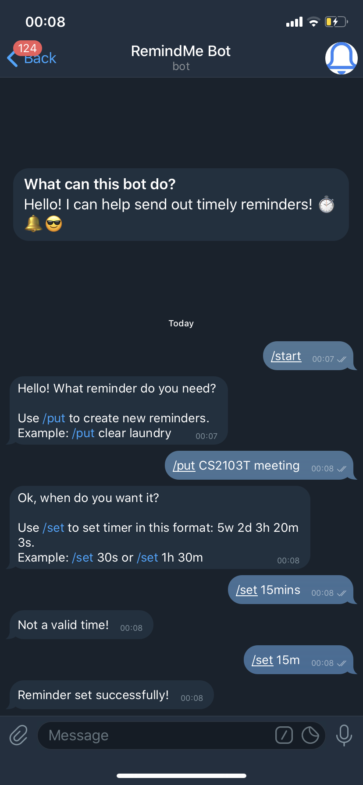

# RemindMe Bot


A friendly telegram bot that allows users to set reminders base on a timer. This reminder bot is built in Python3.
[@remindMe_2020_bot](t.me/remindMe_2020_bot)

This bot is currently not hosted. Please clone the repository and follow the set-up instructions below.

## Getting Started

### Prerequisites

- Python 3.x
- [python-telegram-bot](https://github.com/python-telegram-bot/python-telegram-bot)

## Usage

1. Use ***/start*** to start up the bot.
2. Use ***/put*** to add new reminder. *Example: /put collect laundry*
3. Use ***/set*** to set countdown to reminder. Use "w" for weeks, "d" for days "h" for hours, "m" for minutes and "s" for seconds. *Example: /set 45m 30s* for 45 minutes and 30 seconds.





### Installation

1. Clone this repository.

2. Install or update python-telegram-bot API.
```
$ pip install python-telegram-bot --upgrade
```
3. Run main.py in your terminal.
```
python main.py
```

## Built With

* [Python 3.8](https://www.python.org/downloads/) 
* [python-telegram-bot](https://github.com/python-telegram-bot/python-telegram-bot)

## Authors

* [Ngoh Wei Yue](https://github.com/nweiyue)

## License

This project is licensed under the MIT License - see the [LICENSE](./LICENSE) file for details
